# Shared UI verification

## Change

Keep vault layout and security flows product-owned; remove active-navigation border width changes. Shared assets are pinned to ky-ui 0.2.0 with content hashes. Product layouts, saved theme keys and named presets remain local.

## Capture conditions

Captured 2026-09-25 from this branch, using the application UI (not a design mockup). Real React UI served by Vite, with browser-only read fixtures for /api/auth/me and /api/vault/metadata. The vault is locked; API writes are refused by the fixture.

OS-following Busnes Light and Dark were captured at 1280×900 and 390×844 CSS pixels. Browser device scaling may make PNG dimensions larger. Document width stayed within the viewport in these captured states; local navigation/table scrolling is intentional. Screenshots show the selected-page accent, not a complete accessibility audit.

Live KyIdentity SSO and vault unlock were NOT exercised. The backend correctly refused startup without a configured HTTPS identity provider; authentication was not weakened.

## Checks

83 frontend tests and production build passed. Central ky-ui sync --check verified all ten consumers. Screenshot coverage is Busnes Light/Dark; existing named choices are retained, but not every named palette/page combination was visually exercised.

## Screenshots

| Light | Dark |
| --- | --- |
| 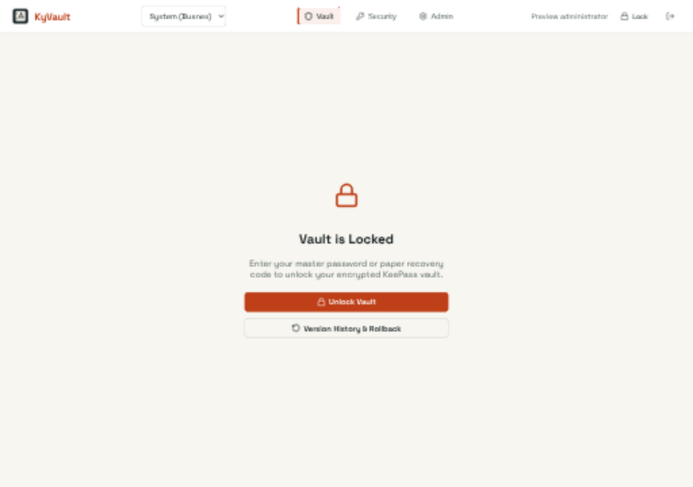 | 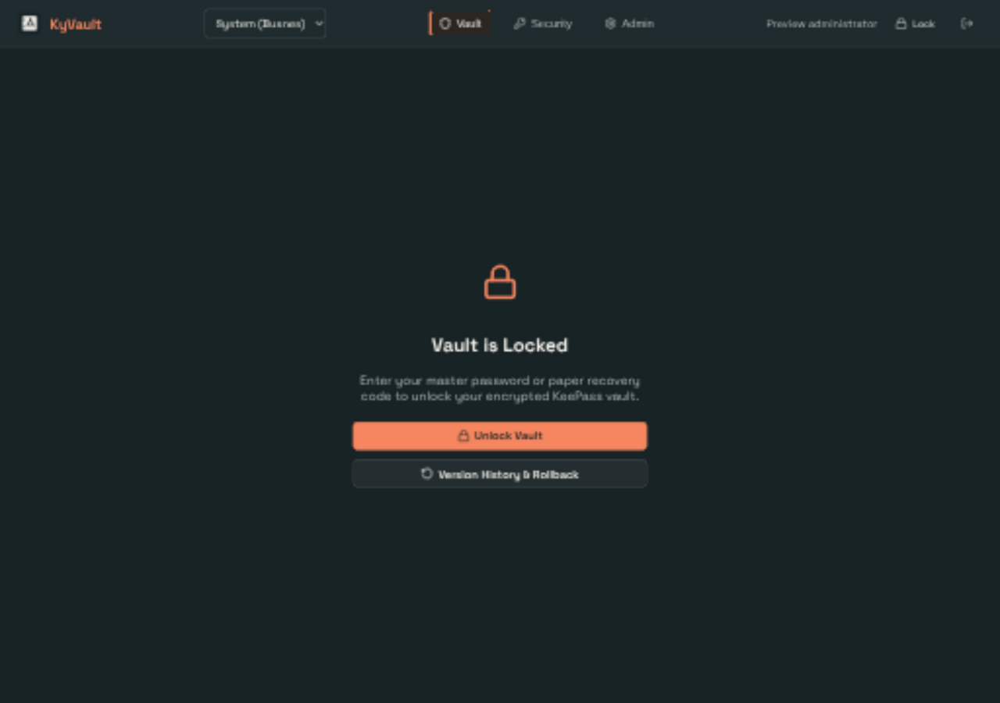 |
| 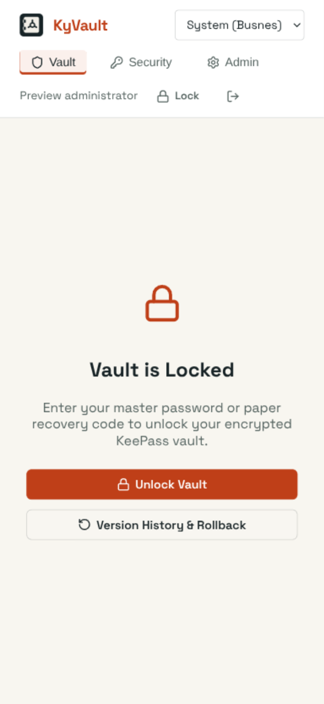 | 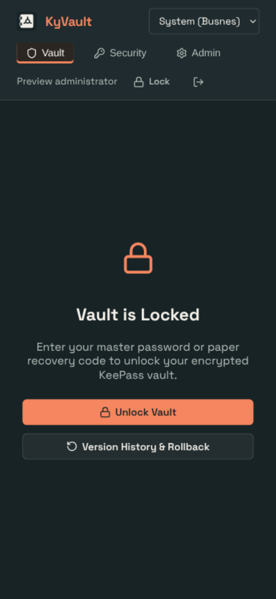 |

## Reproduce

Run npm ci, npm test (where configured), and npm run build in frontend/, then start the product with isolated local preview data following its README. Use System theme, emulate OS light/dark, and inspect both viewport sizes. Do not point preview instances at production data. For KyVault, use a configured development KyIdentity or explicitly labeled read-only browser fixtures; never bypass backend authentication.

## Watchtower

Captured 2026-09-26 from `npm run dev:mock` (`frontend/mock/api.ts`, browser-only, dev-only, never built), which serves a signed-in mock user and supports creating/unlocking a real in-browser vault. No backend or KySignOn was involved.

Exercised in the browser: created a vault and four entries (two `Password1234!`, one at `https://github.com`, one plain; one at `http://shop.example` with a strong password; one unrelated strong/unique password). Watchtower nav item sits between Vault and Security. `#/watchtower` on a locked vault (both after clicking Lock and on a cold reload of the route) shows the "Vault is Locked" screen with an Unlock button and does not auto-open the unlock dialog — only the Vault tab does that. Category counts matched expectations: Reused 2, Weak 2, Insecure URL 1, Missing 2FA 1, Breached `?` (not run). Selecting the Personal folder (which does not contain the GitHub entry) and then clicking the GitHub row under Missing 2FA reset the vault view to All Items and opened the GitHub entry, visible and selected. Toggling the auto-check checkbox opened the HIBP confirm dialog; Cancel left it unchecked. Clicking "Check breaches" and confirming ran a real request to `api.pwnedpasswords.com`, since this sandbox has outbound internet access and the mock does not intercept that call; it returned 2 breached (both `Password1234!` entries), unlike the network-failure result assumed when the sandbox lacks connectivity. Locking and returning to Watchtower showed the unlock prompt again; unlocking put the breach state back to "not run" (`?`) while the other counts were unchanged. At 390px width the category grid was a single column with no horizontal scroll (`scrollWidth === clientWidth === 390`).

Not exercised: live HIBP behind a network-restricted sandbox (a genuine fetch failure path), and KySignOn SSO/vault unlock end to end — both out of scope for the mock harness per existing UI-VERIFICATION conventions above.

### Screenshots

| Light | Dark |
| --- | --- |
| 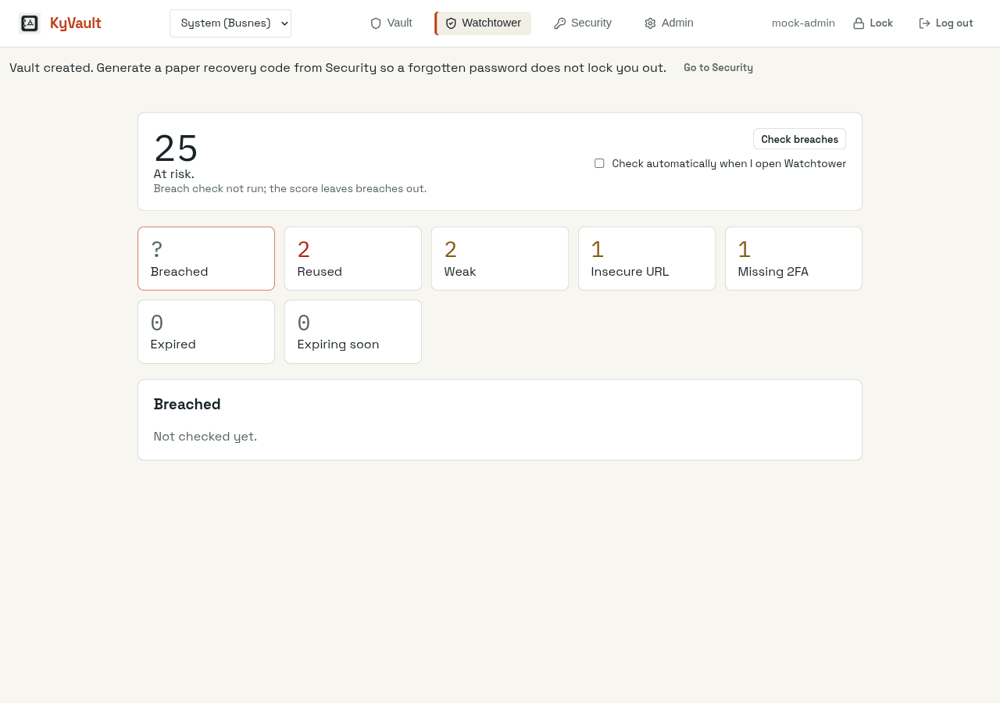 | 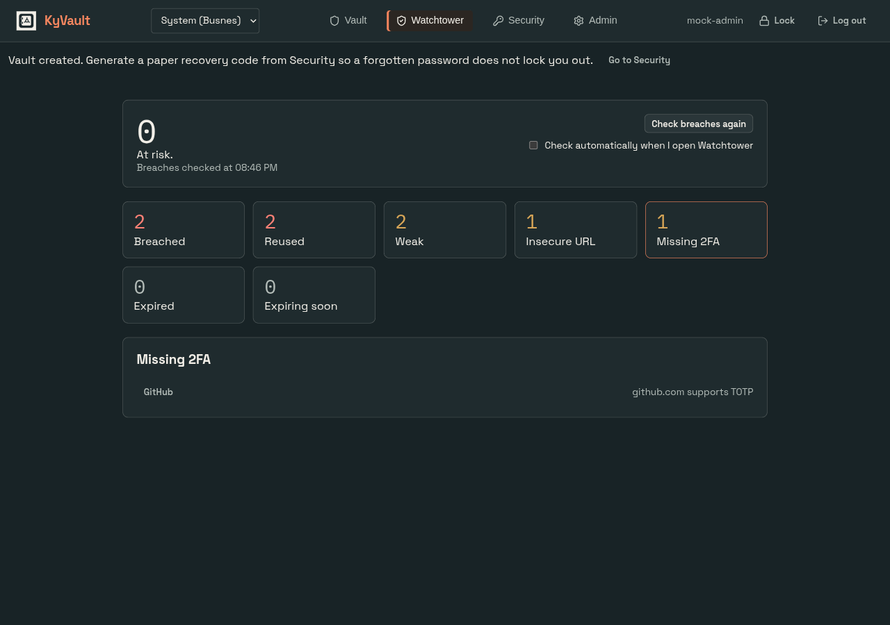 |
| 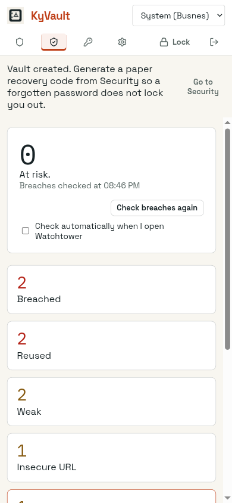 | 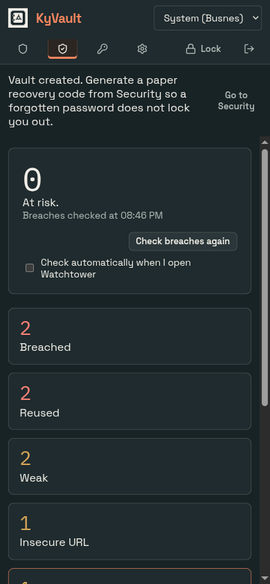 |

## User keys

Captured 2026-09-26 from `npm run dev:mock` on :5878 (`frontend/mock/api.ts`, browser-only, dev-only, never built), which serves a signed-in mock admin and supports creating/unlocking a real in-browser vault. No backend or KySignOn was involved.

Exercised in the browser (Playwright), summarised from the Task 6 manual pass:

1. Created a vault (master password `correct horse battery staple`) as `mock-admin`. Security → "Your key" card showed fingerprint `AD09 D472 0328 0422 09DE` with a Copy button and a created-at timestamp — card renders in the `ready` state.
2. Admin → User Directory: `u-1` (mock-admin)'s row showed `• Key AD09 D472 0328 0422 09DE`, identical to the Security tab; `u-2` (dana) showed `• No key`.
3. Typing the master password and clicking "Replace my key", then confirming, changed the fingerprint to `F77C 6D33 8E2B 552B 6C5B`.
4. Locking and unlocking with the same master password showed the same new fingerprint — it persisted through the publish/adopt round trip, not just in memory.
5. Rotating the vault key (master password re-entered, confirmed) succeeded and left the fingerprint unchanged at `F77C 6D33 8E2B 552B 6C5B`, confirming rotation re-wraps the existing user-key seed rather than publishing a new one.

All Task 6 Step 3 checks from the brief passed as observed above; see `.superpowers/sdd/2026-09-27-user-keys/task-6-report.md` for the full transcript.

Not exercised: live KySignOn SSO/vault unlock end to end, KyAuth or the browser extension against the same interop vector, and a genuine cross-tab publish race (the create-only 409 path is covered by `internal/api` and `userKey.test.ts` unit tests, not manually).

## Shared vaults

Captured 2026-09-27 from `npm run dev:mock` on :5878 (`frontend/mock/api.ts`, dev-only, never built), Chromium through the Playwright MCP tools at 1280×900 CSS pixels, theme System (Busnes) following the OS, which resolved light. No backend, no KySignOn: the mock serves the shared routes, and `dana` (u-2) is a mock identity with a real X-Wing key pair generated at startup, so everything the browser sealed to her was real HPKE. She never signs in — there is no second browser session in this pass.

Exercised in the browser, in this order:

1. Created a vault (master password `correct horse battery staple`), which published a user key. The switcher showed both seeded invitations from dana as badges next to the vault select.
2. Accept on "Household" before any pin: the inviter's fingerprint with "Not verified. Verify with dana before you rely on this vault." and the line "KyVault trusts the server for who is in a vault, never for its contents."
3. Accept on "Legal", whose invitation was sealed by a key dana no longer publishes: "Their key changed since this invitation was sent." — the `invitation` drift.
4. Created the shared vault "Team Finance" from the switcher. It sealed a fresh key to my own published key, created the KDBX in the browser, uploaded it and selected the new vault (`#/shared/<id>`), so create → seal → open works end to end against real HPKE.
5. Members → looked up `dana` → her fingerprint with "Key not verified" and the compare-out-of-band line → Invite as reader. Her row came back `invited` with "Key pinned": trust on first use pinned her key as it was used.
6. Leave vault as the only owner: refused inline with "a shared vault keeps at least one active owner" (409) and the membership unchanged.
7. Accept on "Household" again, now that dana is pinned: "Matches the key you pinned." Accepting added Household to the switcher and left "Team Finance" selected — accepting does not open the vault.
8. Added an entry to Team Finance, which autosaved to v2. Demoted my own row to `reader` (see below) and reloaded: the switcher read "Team Finance — Read-only", the folder pane carried a READ-ONLY badge, and Add Entry, Add Folder, the import buttons and the entry's edit and delete controls were gone; Entry History, Download .kdbx and Export CSV stayed.
9. Admin → Shared vaults: all three vaults, expandable member lists with role and state badges, Team Finance flagged `Ownerless` after the demotion, "Created by u-2" (the server sends the user id here, not a username). Delete vault was refused with "re-authenticate to continue…" and its "Sign in again" link; removing a member succeeded and the list reloaded; the create-restriction checkbox toggled and the mock stored it.

Checked against the mock outside the browser (`curl`), because the UI refuses these client-side: a reader's upload is 403, a non-member's vault is 404, an unaccepted row reading data is 403, demoting the last owner is 409, and a re-seal with a fingerprint the user no longer publishes is 400.

Not exercised: a real KyVault server (everything here is the mock), dark mode and mobile widths for these screens, a second signed-in user, shared key rotation (3c, not built), the stale self-reseal screen (it needs another user's key replace), and the KySignOn sign-in behind the "Sign in again" link. The Accept dialog's "changed" state was captured as the invitation drift; the other route to it — a published key that no longer matches the pin — is covered by `sharedFlows.test.ts`, not by a screenshot, because the mock's dana key is fixed for the life of the process. `POST /api/mock/role` is a dev-only mock route with no server counterpart, used in step 8 because the UI deliberately refuses to change your own role.

Found while capturing and fixed after it: the Members dialog labelled the signed-in user's own key "Key not verified", because a pin for yourself is never written. Your own row now reads "Your key", or "Not the key this browser holds" when the published key is not the one this tab holds. `docs/shared-members.png` predates the fix and still shows the old label.

### Screenshots

| What | Image |
| --- | --- |
| Switcher with invitation badges | 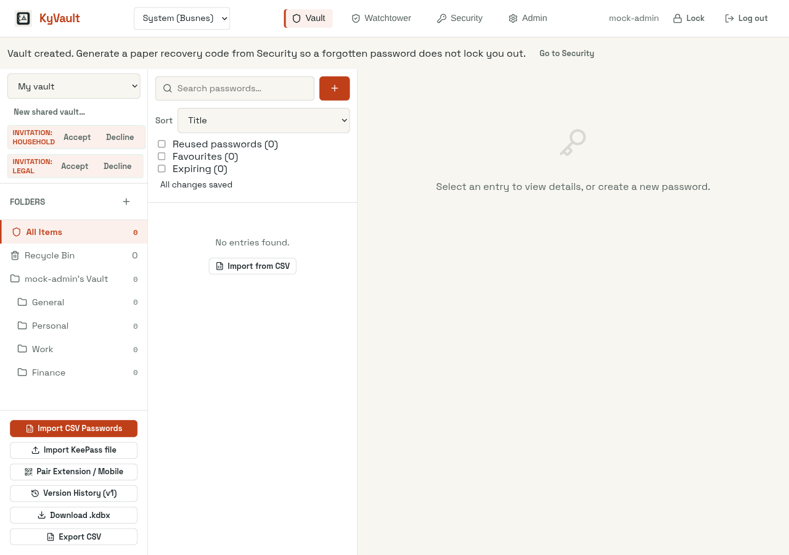 |
| Accept, key not pinned | 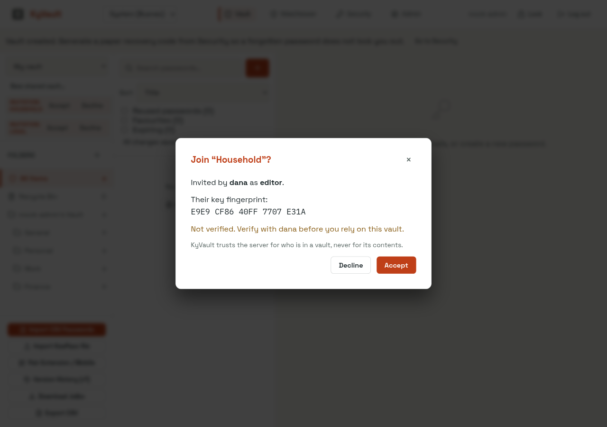 |
| Accept, key pinned | 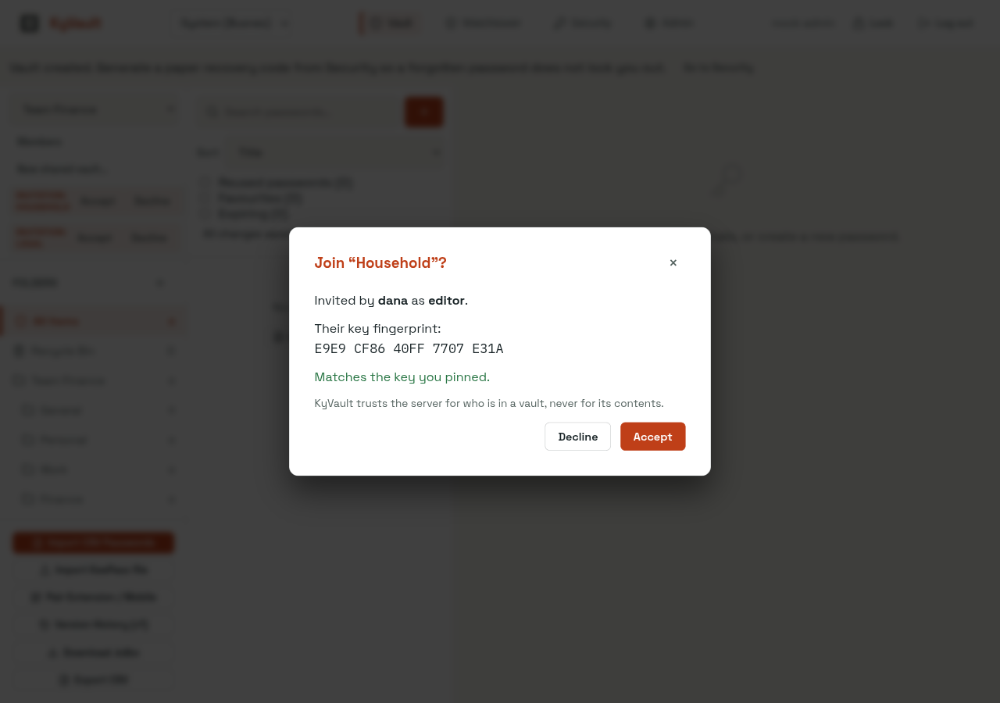 |
| Accept, inviter's key changed | 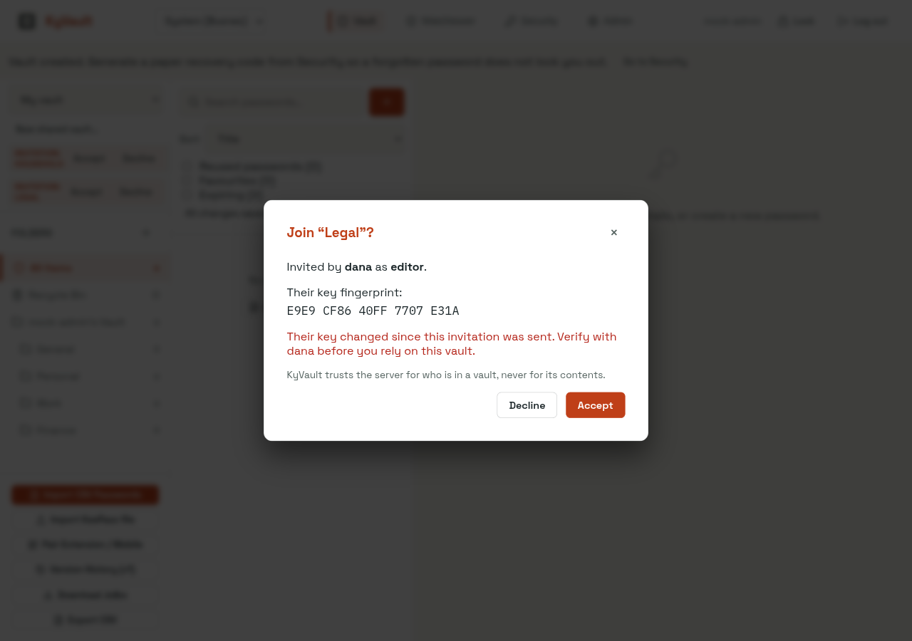 |
| Members with the invite form | 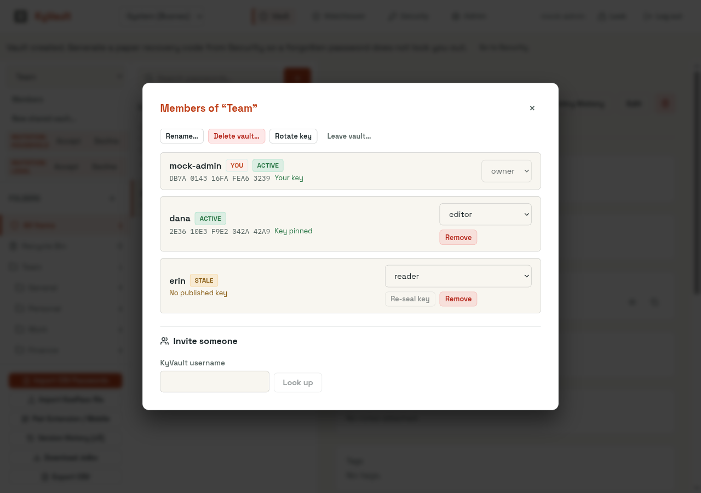 |
| A reader's read-only vault | 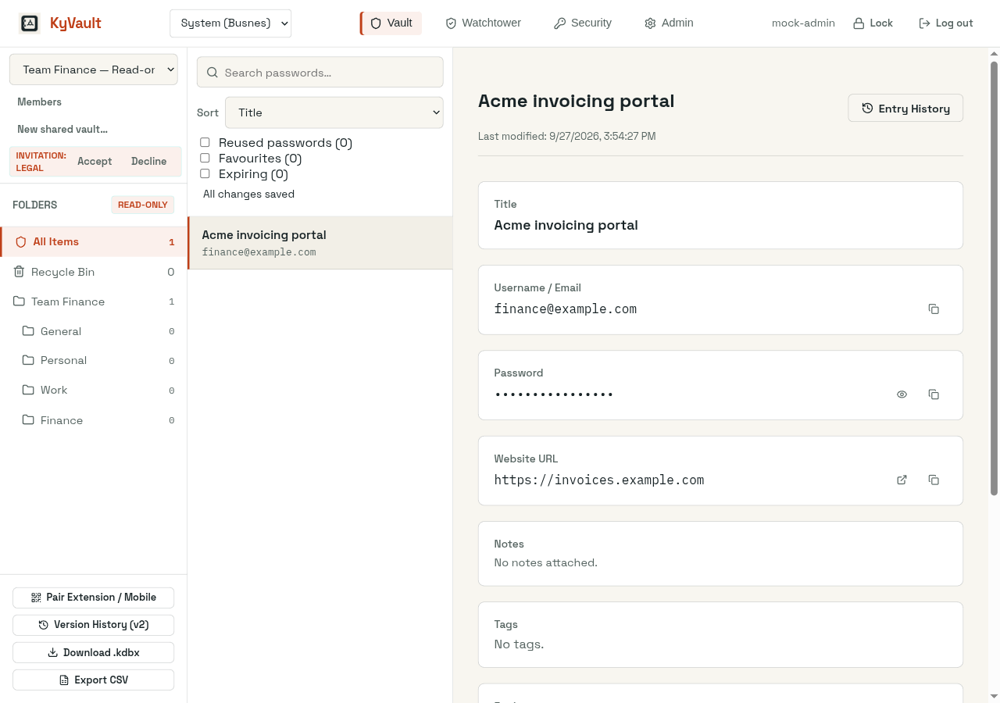 |
| Admin → Shared vaults | 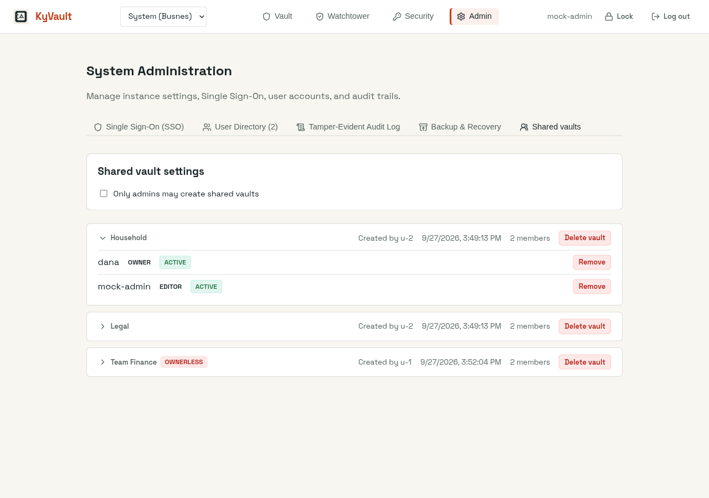 |
| Admin refusing a delete without a fresh sign-in | 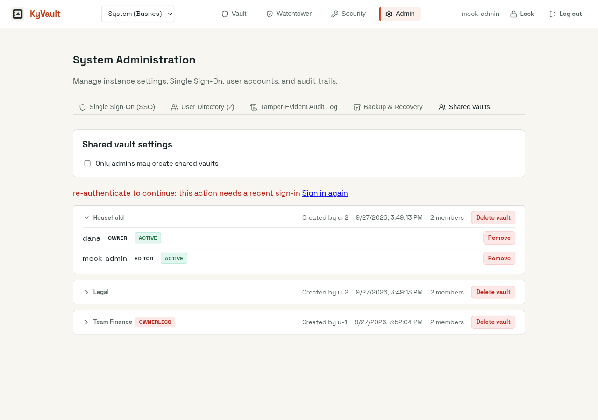 |
